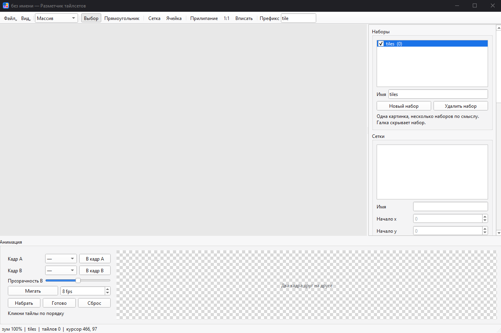

# Разметчик тайлсетов

Небольшая программа, чтобы быстро разметить лист спрайтов: прямоугольники, сетка под шрифт, несколько наборов на одной картинке. На выходе обычный JSON, который можно отдать игре. Это не Tiled и не редактор уровней — только границы тайлов и ваши поля.

Светлая тема, пиксели без сглаживания, зум целыми ступенями.

- Прямоугольники и временные сетки под шрифт
- Несколько наборов на одном листе
- Свои поля у тайла
- JSON массивом или словарём по имени
- `.aseprite` и `.ase` без установленного Aseprite
- Лист на холсте обновляется сам, когда картинку сохранили в редакторе
- Два кадра друг на друге и длинная анимация по порядку кликов
- Подписи тайлов: ничего, id или имя
- Недавние проекты и открытие папки с файлами
- Чистый экспорт без служебного блока `editor`

## Запуск

Скачайте [TileMapper.exe](https://github.com/TreeLoys/TileMapper/releases) и запустите его. Отдельный Python для этого не требуется.

Из исходников:

```bash
pip install -r requirements.txt
python -m tilemapper
```

Нужны Python 3.11+ и [PySide6](https://pypi.org/project/PySide6/). Рядом с программой есть `tilemapper/icon.ico` — им можно пометить ярлык.

Картинку или JSON можно перетащить в окно.

Следит за файлом картинки: сохранили `.png` или `.aseprite` в редакторе — лист на холсте обновляется сам, разметка не сбрасывается.

## Как размечать

На панели четыре инструмента.

| Клавиша | Инструмент | Что делает |
| --- | --- | --- |
| `1` | Выбор | Клик и перетаскивание. Стрелки двигают на 1 px, с Shift — на 8. `Ctrl+D` дублирует, `Delete` удаляет |
| `2` | Прямоугольник | Произвольный кусок. После отпускания кнопки курсор встаёт в поле имени |
| `3` | Сетка | Область, затем ширина и высота ячейки. Сеток может быть несколько, они временные |
| `4` | Ячейка | Клик — один тайл и имя. Протяжка — пачка `prefix_0`, `prefix_1`, … `Enter` переходит к следующей ячейке |

`G` включает прилипание к активной сетке. `F` вписывает картинку, `Ctrl+1` ставит масштаб 1:1. Колёсико приближает, средняя кнопка или пробел с левой кнопкой двигают холст.

`Esc` снимает выделение. Если у прямоугольника ещё нет имени, он удаляется.

Один лист может нести несколько наборов, как слои: шрифт, кнопки, цифры. Галка в списке прячет набор. Чужие тайлы рисуются пунктиром, клик по ним переключает слой.

Снизу два кадра можно положить друг на друга и помигать. Длиннее: **Набрать**, кликнуть тайлы по порядку и **Готово**. Цикл идёт в том же порядке, а на тайлы пишутся `animation_name` и `animation_id` (номер кадра с нуля). Список анимаций справа появляется после первой.

**Вид** переключает подписи. У прямоугольников: ничего, `id` или имя. У сеток отдельного id нет, поэтому только имя в углу сетки или ничего.

## Файл

| | |
| --- | --- |
| `Ctrl+Shift+O` | Открыть картинку как новый документ |
| `Ctrl+O` | Открыть JSON |
| `Ctrl+S` | Сохранить рабочий файл |
| `Ctrl+Shift+S` | Сохранить как |
| `Ctrl+E` | Экспорт чистый: JSON без блока `editor` |

Картинки: PNG, BMP, GIF, JPEG, WebP, а ещё `.aseprite` и `.ase`. Aseprite ставить не нужно: читается первый кадр, видимые слои сводятся. Если кадров несколько, в статусной строке будет пометка.

Если рядом с картинкой уже лежит JSON с тем же именем, первое сохранение предложит `UI_2.json`, `UI_3.json` и так далее, чтобы `Ctrl+S` не затёр старую разметку. Уже открытый файл по-прежнему пишется в себя.

**Показать в папке** открывает проводник на JSON и картинке. Первый пункт меню — последний открытый проект. Внизу меню пять недавних JSON, остальные — в **Все недавние**. Картинки в этот список не попадают. **Убрать из недавних…** чистит список.

Путь к картинке в JSON записывается относительно файла. На другом диске остаётся абсолютным.

## JSON

Один набор, тайлы массивом. Имя лежит внутри объекта, свои поля сохраняются как есть, числа остаются числами.

```json
{
  "image": "tileset.png",
  "nametileset": "ground",
  "tiles": [
    {"id": 0, "name": "grass", "x": 0, "y": 0, "w": 32, "h": 32, "any_if_use": 4},
    {"id": 1, "name": "stone", "x": 32, "y": 0, "w": 32, "h": 32}
  ]
}
```

Режим **Словарь**: имя тайла — ключ и больше внутри объекта не повторяется. Имена должны быть непустыми и уникальными внутри набора.

```json
{
  "image": "tileset.png",
  "nametileset": "ground",
  "tiles": {
    "grass": {"id": 0, "x": 0, "y": 0, "w": 32, "h": 32, "any_if_use": 4},
    "stone": {"id": 1, "x": 32, "y": 0, "w": 32, "h": 32}
  }
}
```

Несколько наборов на одной картинке:

```json
{
  "image": "UI.png",
  "tilesets": [
    {"nametileset": "digits", "tiles": {"0": {"id": 0, "x": 0, "y": 0, "w": 8, "h": 12}}},
    {"nametileset": "buttons", "tiles": [{"id": 0, "name": "pause", "x": 0, "y": 40, "w": 16, "h": 16}]}
  ]
}
```

Режим массива или словаря общий на документ. Незнакомые поля в корне JSON не выкидываются.

Рабочее сохранение дописывает блок `editor`: зум, активный набор, какие слои видны, временные сетки, режим подписей. Игре он не нужен. **Экспорт чистый** пишет тот же файл без `editor`.

## Проверка

```bash
python -m unittest discover -s tests
```
